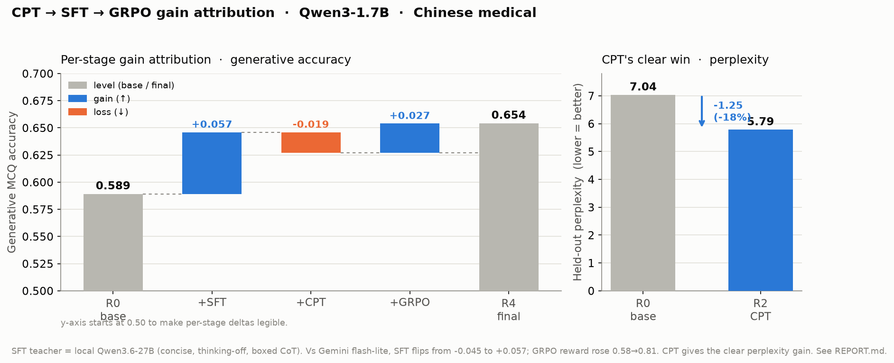

# cpt-sft-grpo-med-zh

[](https://huggingface.co/jiaqianjing)
[](https://wandb.ai/jiaqianjing/med-1b7-cpt-sft-grpo)
[](https://huggingface.co/Qwen/Qwen3-1.7B-Base)
[](https://www.apache.org/licenses/LICENSE-2.0)

Measure and **cleanly separate** the gains of **CPT → SFT → GRPO** on a small base model
(`Qwen3-1.7B-Base`) in the **Chinese medical** domain, tracked in Weights & Biases.
Full write-up: **[REPORT.md](./REPORT.md)** · design: **[DESIGN.md](./DESIGN.md)** ·
**stage-by-stage walkthrough with real data examples: [docs/](./docs/)**.

> Started on Qwen3-4B-Base but it was near-ceiling on Chinese medical MCQ (naive SFT only
> degraded it), so the study moved to the weaker **1.7B** base for measurable headroom.

## 🤗 Model weights (Hugging Face)

| Stage | Model | Link |
|-------|-------|------|
| CPT | continued pre-training (0.9B tok, TCM-heavy) | [jiaqianjing/qwen3-1.7b-med-zh-cpt](https://huggingface.co/jiaqianjing/qwen3-1.7b-med-zh-cpt) |
| SFT | SFT-only (60k medical CoT) | [jiaqianjing/qwen3-1.7b-med-zh-sft](https://huggingface.co/jiaqianjing/qwen3-1.7b-med-zh-sft) |
| CPT→SFT | CPT then SFT | [jiaqianjing/qwen3-1.7b-med-zh-cpt-sft](https://huggingface.co/jiaqianjing/qwen3-1.7b-med-zh-cpt-sft) |
| CPT→SFT→GRPO | full pipeline | [jiaqianjing/qwen3-1.7b-med-zh-grpo](https://huggingface.co/jiaqianjing/qwen3-1.7b-med-zh-grpo) |

> 上表 HF 权重已更新为**本地 Qwen 教师**版本（SFT 生成 0.646 / 全链路 **0.654**，见下方 Results）。
> 原 Gemini 教师版本（0.544 / 0.552）保留在各 repo 的 HF git 历史中；CPT 权重与教师无关、未变。

📊 All training curves, eval tables, and the gain-attribution **waterfall** →
[**W&B: med-1b7-cpt-sft-grpo**](https://wandb.ai/jiaqianjing/med-1b7-cpt-sft-grpo)

## TL;DR — how gains are separated

Ablation matrix on one fixed eval suite (three axes: knowledge / generative / perplexity):

| Run | CPT | SFT | GRPO |
|-----|:---:|:---:|:----:|
| R0  |  —  |  —  |  —   |
| R1  |  —  |  ✓  |  —   |
| R2  |  ✓  |  —  |  —   |
| R3  |  ✓  |  ✓  |  —   |
| R4  |  ✓  |  ✓  |  ✓   |

```
SFT = R1 - R0      CPT = R3 - R1      GRPO = R4 - R3      CPT-ppl = PPL(R0) - PPL(R2)
```

## Results (Qwen3-1.7B) — see [REPORT.md](./REPORT.md)



Per-run eval, **local-Qwen distillation teacher** (`Qwen/Qwen3.6-27B`, current default):

| Run | generative | knowledge | perplexity |
|-----|:---:|:---:|:---:|
| R0 base | 0.589 | 0.661 | 7.04 |
| R2 CPT | — | 0.636 | **5.79** |
| R1 SFT | **0.646** | 0.638 | — |
| R3 CPT+SFT | 0.627 | 0.626 | — |
| R4 +GRPO | **0.654** | 0.635 | — |

### Teacher A/B — distillation quality drives the SFT gain

Identical pipeline and eval; only the SFT CoT **teacher** changes. Per-stage generative-accuracy gain:

| Generative gain | Gemini flash-lite (original) | local Qwen3.6-27B (current) |
|---|:---:|:---:|
| SFT  (R1−R0)  | −0.045 | **+0.057** |
| CPT  (R3−R1)  | −0.008 | −0.019 |
| GRPO (R4−R3)  | +0.015 | +0.028 |
| **net R0→R4** | **−0.037** | **+0.065** |

**Honest finding:** CPT gives a clear perplexity gain (−1.25, teacher-independent). The original run
used a weak teacher (Gemini flash-lite) and SFT actively *hurt* generative accuracy — the full
pipeline landed **below** base (0.552 < 0.589). Swapping in a stronger, format-aligned local teacher
(concise, thinking-off, quality-gated `\boxed{}` CoT) flips SFT to a clear **+0.057** and lifts the
full pipeline to **0.654** — confirming the earlier diagnosis that **data quality, not stage design,
was the bottleneck**. GRPO adds a small but consistent gain (+0.028 gen; reward 0.58→0.81). Knowledge-MCQ
accuracy dips slightly under the CoT teacher (a format-vs-recall trade). See REPORT §5–7.

## 经验与启示 — CPT 还值得做吗？

一条可复用的结论:**CPT 优化的是「困惑度」而非「任务准确率」;在已经很强的现代 base 上、用有限
语料做全参 CPT,若目标指标是任务准确率(如 MCQ),CPT 往往不划算。**

本实验的判决很清楚:CPT 困惑度 **−1.25(✅ 干净正收益)**,但下游 MCQ 准确率 R3−R1 =
生成 **−0.019** / 知识 **−0.012(❌ 反而略降)**。而同一套实验里,仅更换 SFT 蒸馏教师就带来
**+0.057** —— 比 CPT 在准确率轴上的贡献大一个数量级,方向还相反。

**但这不等于「CPT 无用」,关键在于三个对齐:**
- **指标对齐** —— 目标是生成质量 / 术语 / 领域召回 → 困惑度收益会兑现,CPT 值得;目标是选择题准确率 → 优先堆 SFT/GRPO 数据质量。
- **base 领域缺口** —— base 越强、语料越常见,CPT 边际收益越低;低资源语言 / 专有语料 / cutoff 后新知识才有明显空间。
- **规模与手法** —— 0.9B tokens 偏小;全参 CPT 会把分布拉向语料风格、冲淡 base 已有先验(这正是 R3 掉分的机制),用 LoRA / 更低 LR / 混入通用数据回放可缓解。

**元经验:** ① 把干预对齐到你最终衡量的指标(CPT ↔ 困惑度、SFT ↔ 格式/推理、GRPO ↔ 可验证奖励),错配就白花算力;② **数据质量 >> 多加阶段** —— 全 study 最大的单点杠杆是把 SFT 教师换强,而非新增流程。

> 注:这是 **n=1** 证据(单 base / 单领域 / 0.9B 语料 / 全参 / MCQ 指标),足以支撑「这类设定下 CPT 不划算」,不足以证明「CPT 普遍无用」。

## 📚 Training Data

### CPT（继续预训练）— 原始医学文本，约 0.9B tokens

| 数据集 | 说明 |
|--------|------|
| [SylvanL/Traditional-Chinese-Medicine-Dataset-Pretrain](https://huggingface.co/datasets/SylvanL/Traditional-Chinese-Medicine-Dataset-Pretrain) | ~533k 条中医文本，~575MB，99%+ 中文；主要语料 |
| [FreedomIntelligence/TCM-Pretrain-Data-ShizhenGPT](https://huggingface.co/datasets/FreedomIntelligence/TCM-Pretrain-Data-ShizhenGPT) | 含 TCM_Book_Corpus 与 TCM_Web_Corpus 两个子集，补充 TCM 文本 |
| [shibing624/medical](https://huggingface.co/datasets/shibing624/medical) | 百科+教材，~0.2B tokens（可选，需 `trust_remote_code`） |

### SFT（监督微调）— 60k 医学 CoT 问答对

| 数据集 | 说明 |
|--------|------|
| [FreedomIntelligence/medical-o1-reasoning-SFT](https://huggingface.co/datasets/FreedomIntelligence/medical-o1-reasoning-SFT) | zh + zh_mix 子集，共 ~45k 条真实 CoT（思维链推理），**核心推理种子** |
| [FreedomIntelligence/Huatuo26M-Lite](https://huggingface.co/datasets/FreedomIntelligence/Huatuo26M-Lite) | ~177k 医学 QA（无 CoT），采样用于扩展覆盖面 |
| [michaelwzhu/ShenNong_TCM_Dataset](https://huggingface.co/datasets/michaelwzhu/ShenNong_TCM_Dataset) | ~112k 中医 QA，采样用于补充 TCM 领域广度 |

> 无 CoT 样本用本地 `Qwen/Qwen3.6-27B`（SGLang、8 卡张量并行）蒸馏生成推理链，
> 经质量门 + 拒绝采样保留约 16.6k 条。上表结果即基于此本地教师；与原 Gemini
> flash-lite 教师的对比见上方 **Teacher A/B**（本地教师把 SFT 生成增益从 −0.045 翻正为 +0.057）。

### GRPO（强化学习）— 可验证答案的选择题

| 数据集 | 说明 |
|--------|------|
| [bigbio/med_qa](https://huggingface.co/datasets/bigbio/med_qa) (med_qa_zh_4options) | 中国医学执业考试选择题，4 选项单答案 |
| [fzkuji/CMExam](https://huggingface.co/datasets/fzkuji/CMExam) | 中国医学考试题库，train 54k / val 6.8k / test 6.8k |

### Eval（评测基准）

| 基准 | 医学子集 |
|------|----------|
| [CMMLU](https://huggingface.co/datasets/haonan-li/cmmlu) | anatomy, clinical_knowledge, college_medicine, genetics, virology, nutrition, traditional_chinese_medicine, professional_medicine |
| [C-Eval](https://huggingface.co/datasets/ceval/ceval-exam) | basic_medicine, clinical_medicine, physician |
| [FreedomIntelligence/CMB](https://huggingface.co/datasets/FreedomIntelligence/CMB) (CMB-Exam) | 中国医学考试综合题库，test 11.2k（含多选） |

## Layout

```
configs/       project schema (Pydantic) + framework YAMLs
med_pipeline/  data/ tools/ train/ eval/ report/
setup/         install.sh · check_env.py
scripts/       prepare-data · run-matrix · post-CPT · HF upload
```

## Quickstart

```bash
bash setup/install.sh --full     # 3 envs: eval / train (torch2.8) / grpo (trl+vllm)
                               # local teacher additionally uses setup/install_sglang.sh
python setup/check_env.py --full # verify GPUs, versions, .env keys
bash setup/install_sglang.sh
bash scripts/run_qwen_distill_sglang.sh  # local Qwen teacher -> merge refreshed SFT data
python -m med_pipeline.train.run_cpt   # then:
bash scripts/run_post_cpt.sh     # R1→R3→evals→R4→gain waterfall to W&B
```

## Secrets

`.env` (gitignored) provides `WANDB_API_KEY`, `GEMINI_API_KEY`, `ANTHROPIC_API_KEY`, `HF_TOKEN`.
Never commit real data, checkpoints, or `.env`.
